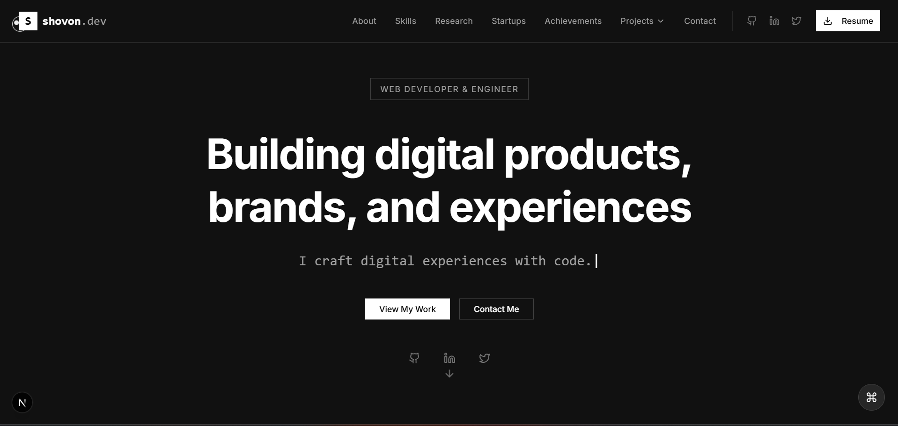

# Modern Developer Portfolio 🚀

> A sleek, modern portfolio website built with Next.js, Tailwind CSS, and Framer Motion. Perfect for developers, engineers, and tech professionals to showcase their skills, projects, and achievements in a professional and visually appealing way.

## 📋 Table of Contents

- [Features](#-features)
- [Sections](#-sections)
- [Technologies Used](#️-technologies-used)
- [Getting Started](#-getting-started)
- [Customization](#-customization)
- [Responsive Design](#-responsive-design)
- [SEO](#-seo)
- [Deployment](#-deployment)
- [License](#-license)
- [Acknowledgements](#-acknowledgements)
- [Contact](#-contact)

## 🌟 Features

- **Modern Design**: Clean, minimalist design with a focus on content and user experience
- **Fully Responsive**: Looks great on all devices, from mobile to desktop
- **Interactive UI**: Smooth animations and transitions powered by Framer Motion
- **Data-Driven**: All content is stored in JSON files for easy updates
- **SEO Optimized**: Built with SEO best practices in mind
- **Performance Focused**: Fast loading times and optimized assets
- **Accessibility**: WCAG compliant for better accessibility
- **Dark Mode**: Sleek dark theme that's easy on the eyes

## 📋 Sections

- **Hero**: Eye-catching introduction with animated text
- **About**: Personal information and background
- **Skills**: Technical skills and expertise
- **Timeline**: Professional and educational journey
- **Research Interests**: Academic and research focus areas
- **Startups & Organizations**: Leadership roles and entrepreneurial ventures
- **Achievements**: Awards, recognitions, and accomplishments
- **Projects**: Showcase of notable projects with detailed information
- **Testimonials**: Feedback from clients and colleagues
- **Blog**: Latest articles and thoughts
- **Contact**: Contact form and information

## 🛠️ Technologies Used

- **Next.js**: React framework for production
- **TypeScript**: For type safety and better developer experience
- **Tailwind CSS**: Utility-first CSS framework
- **Framer Motion**: Animation library for React
- **Lucide Icons**: Beautiful, consistent icons
- **Shadcn UI**: Reusable UI components
- **Vercel**: Deployment and hosting

## 🚀 Getting Started

### Prerequisites

- Node.js 18.x or higher
- npm or yarn

### Installation

1. Clone the repository:
   \`\`\`bash
   git clone https://github.com/sh00von/minimal-black-portfolio
   cd minimal-black-portfolio
   \`\`\`

2. Install dependencies:
   \`\`\`bash
   npm install
   # or
   yarn install
   \`\`\`

3. Run the development server:
   \`\`\`bash
   npm run dev
   # or
   yarn dev
   \`\`\`

4. Open [http://localhost:3000](http://localhost:3000) in your browser to see the result.

## 📝 Customization

### Content

All content is stored in JSON files in the `public/data` directory. You can easily update the content by editing these files:

- `personal.json`: Personal information, bio, education, etc.
- `skills.json`: Technical skills and expertise
- `timeline.json`: Professional and educational journey
- `projects.json`: Project showcase
- `research.json`: Research interests and publications
- `startups.json`: Startups and organizations
- `achievements.json`: Awards and accomplishments
- `blog.json`: Blog posts
- `testimonials.json`: Client and colleague testimonials
- `social.json`: Social media links
- `navigation.json`: Navigation items

### Styling

The project uses Tailwind CSS for styling. You can customize the design by editing:

- `tailwind.config.ts`: Tailwind configuration
- `app/globals.css`: Global CSS styles

## 📱 Responsive Design

The portfolio is fully responsive and looks great on all devices:

- **Mobile**: Optimized for small screens with a mobile-friendly navigation
- **Tablet**: Adjusted layouts for medium-sized screens
- **Desktop**: Full experience with all features

## 🔍 SEO Features

The portfolio is built with SEO best practices in mind:

- **Semantic HTML5**: Proper use of HTML5 elements for better structure and accessibility
- **Meta Tags**: Comprehensive meta tags for better social sharing and search engine visibility
- **Structured Data**: JSON-LD implementation for rich snippets
- **Optimized Images**: Automatic image optimization with Next.js
- **Performance**: Lighthouse score optimization
- **Mobile-First**: Responsive design with mobile-first approach
- **Sitemap**: Automatic sitemap generation
- **Robots.txt**: Proper search engine crawling instructions
- **Open Graph**: Enhanced social media sharing
- **Twitter Cards**: Optimized Twitter sharing

## 🌐 Deployment

The easiest way to deploy your portfolio is to use the [Vercel Platform](https://vercel.com/new).

1. Push your code to a GitHub repository
2. Import the project to Vercel
3. Vercel will automatically deploy your application

## 📄 License

This project is licensed under the MIT License - see the LICENSE file for details.

## 🙏 Acknowledgements

- [Next.js](https://nextjs.org/)
- [Tailwind CSS](https://tailwindcss.com/)
- [Framer Motion](https://www.framer.com/motion/)
- [Lucide Icons](https://lucide.dev/)
- [Shadcn UI](https://ui.shadcn.com/)

## 📧 Contact

If you have any questions or feedback, feel free to reach out:

- Email: minar.svn@gmail.com
- LinkedIn: [Minaruzzaman Shovon](linkedin.com/in/minarsvn9090)

## 📊 Project Stats

## ⭐ Show your support

Give a ⭐️ if this project helped you!

## 📝 Contributing

Contributions, issues, and feature requests are welcome! Feel free to check the [issues page](https://github.com/sh00von/minimal-black-portfolio/issues).

---

  Made with ❤️ by <a href="https://github.com/sh00von">Minaruzzaman Shovon</a>

  Built with Next.js, TypeScript, Tailwind CSS, and Framer Motion

